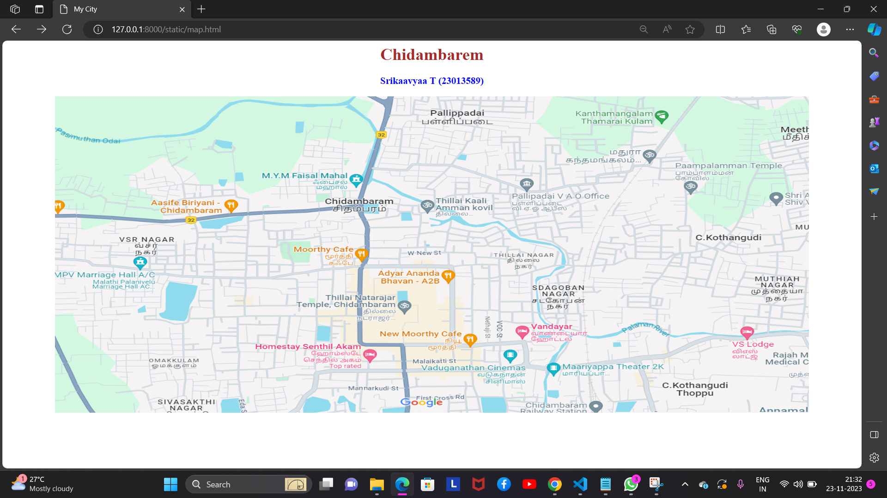
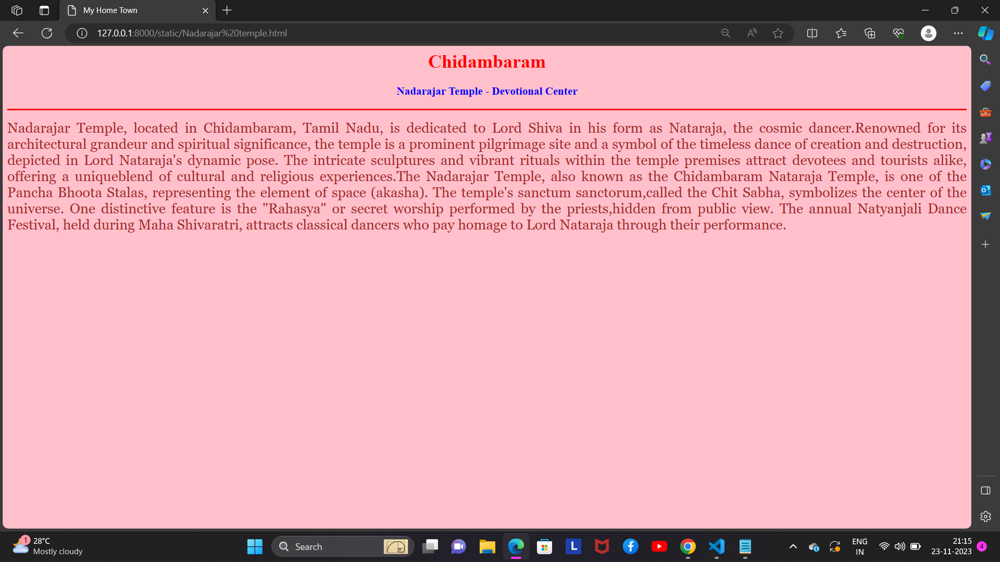
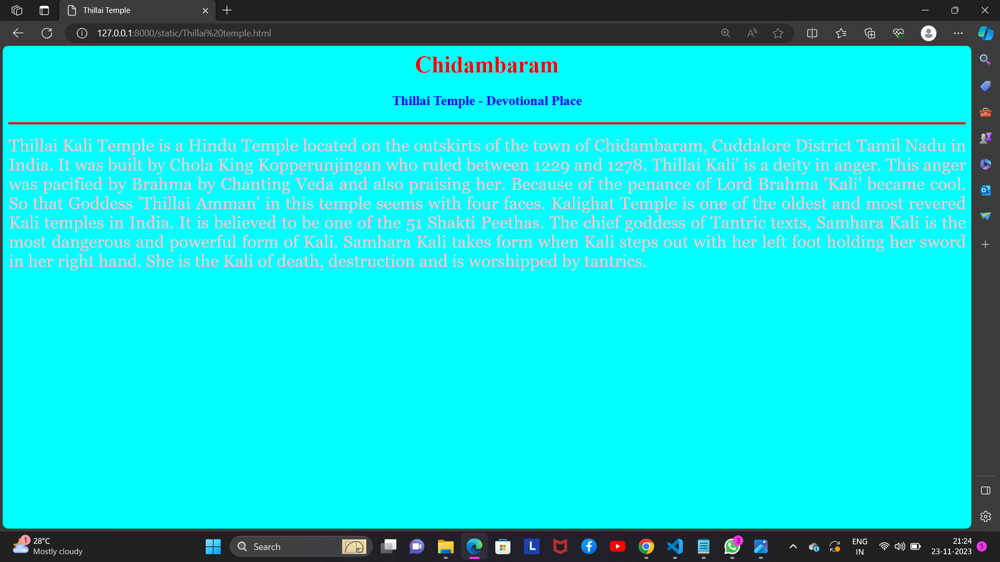
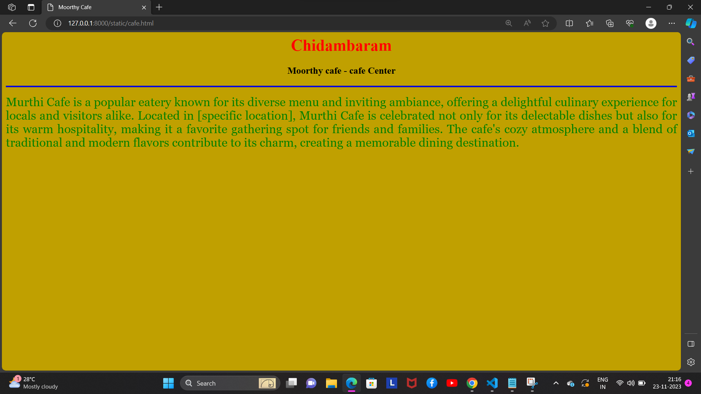
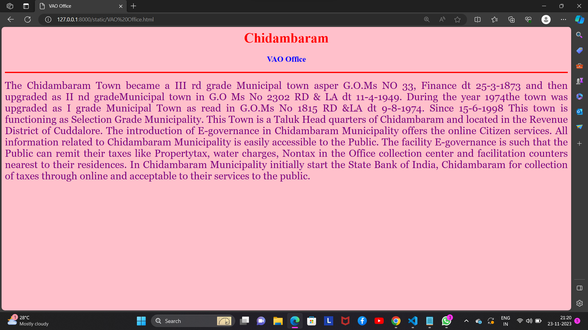

# Ex04 Places Around Me
## Date:22/11/2023

## AIM
To develop a website to display details about the places around my house.

## DESIGN STEPS

### STEP 1
Create a Django admin interface.

### STEP 2
Download your city map from Google.

### STEP 3
Using ```<map>``` tag name the map.

### STEP 4
Create clickable regions in the image using ```<area>``` tag.

### STEP 5
Write HTML programs for all the regions identified.

### STEP 6
Execute the programs and publish them.

## CODE
```
map.html
<html>
<head>
<title>My City</title>
</head>
<body>
<h1 align="center">
<font color="brown"><b>Chidambarem</b></font>
</h1>
<h3 align="center">
<font color="blue"><b>Srikaavyaa T (23013589)</b></font>
</h3>
<center>

<map name="MyCity">
<area shape="circle" coords="640,400,40" href="Nadarajar temple.html" title=" Nadarajar Temple">
<area shape="circle" coords="690,200,30" href="Thillai temple.html" title=" Thillai Temple">
<area shape="circle" coords="880,430,30" href="Vandayar Hotel.html" title=" Vandayar Hotel">
<area shape="circle" coords="580,300,20" href="cafe.html" title=" Cafe">
<area shape="circle" coords="890,190,30" href="VAO Office.html" title=" VAO Office">
</map>
</center>
</body>
<html>

Nadarajar temple.html

<html>
<head>
<title>My Home Town</title>
</head>
<body bgcolor="pink">
<h1 align="center">
<font color="red"><b>Chidambarem</b></font>
</h1>
<h3 align="center">
<font color="blue"><b>Nadarajar Temple - Devotional Centre</b></font>
</h3>
<hr size="3" color="red">
<p align="justify">
<font face="Georgia" size="5">
Nadarajar Temple, located in Chidambaram, Tamil Nadu, is dedicated to Lord Shiva in his form as Nataraja,
the cosmic dancer.Renowned for its architectural grandeur and spiritual significance, the temple is
a prominent pilgrimage site and a symbol of the timeless dance of creation and destruction, depicted in
Lord Nataraja's dynamic pose. The intricate sculptures and vibrant rituals within the temple premises
attract devotees and tourists alike, offering a uniqueblend of cultural and religious experiences.The Nadarajar Temple,
also known as the Chidambaram Nataraja Temple, is one of the Pancha Bhoota Stalas, representing the element of space
(akasha). The temple's sanctum sanctorum,called the Chit Sabha, symbolizes the center of the universe. One distinctive
feature is the "Rahasya" or secret worship performed by the priests,hidden from public view. The annual 
Natyanjali Dance Festival, held during Maha Shivaratri, attracts classical dancers who pay homage to Lord
Nataraja through their performance.
</font>
</p>
</body>
</html>

cafe.html

<html>
<head>
<title> Murthy Cafe</title>
</head>
<body bgcolor="clam">
<h1 align="center">
<font color="red"><b>Chidambarem</b></font>
</h1>
<h3 align="center">
<font color="black"><b> Murthy cafe - cafe Centre</b></font>
</h3>
<hr size="3" color="voilet">
<p align="justify">
<font face="Georgia" size="5">
Murthi Cafe is a popular eatery known for its diverse menu and inviting ambiance,
offering a delightful culinary experience for locals and visitors alike.
Located in [specific location], Murthi Cafe is celebrated not only for its delectable
dishes but also for its warm hospitality, making it a favorite gathering spot for 
friends and families. The cafe's cozy atmosphere and a blend of traditional and modern
flavors contribute to its charm, creating a memorable dining destination.
</font>
</p>
</body>
</html>

Thillai Temple.html

<html>
<head>
<title>Thillai Temple</title>
</head>
<body bgcolor="cyan">
<h1 align="center">
<font color="red"><b>Chidambarem</b></font>
</h1>
<h3 align="center">
<font color="blue"><b>Thillai Temple - Devotional Place</b></font>
</h3>
<hr size="3" color="red">
<p align="justify">
<font face="Georgia" size="5">
Thillai Kali Temple is a Hindu Temple located on the outskirts of the town of Chidambaram,
Cuddalore District Tamil Nadu in India. It was built by Chola King Kopperunjingan who 
ruled between 1229 and 1278. Thillai Kali' is a deity in anger. This anger was pacified by
Brahma by Chanting Veda and also praising her. Because of the penance of Lord Brahma 'Kali'
became cool. So that Goddess 'Thillai Amman' in this temple seems with four faces. Kalighat Temple 
is one of the oldest and most revered Kali temples in India. It is believed to be one of the
51 Shakti Peethas. The chief goddess of Tantric texts, Samhara Kali is the most dangerous and
powerful form of Kali. Samhara Kali takes form when Kali steps out with her left foot holding
her sword in her right hand. She is the Kali of death, destruction and is worshipped by tantrics.
</font>
</p>
</body>
</html>

Vandayar Hotel.html

<html>
<head>
<title>Vandayar Hotel</title>
</head>
<body bgcolor="orange">
<h1 align="center">
<font color="red"><b>Chidambarem</b></font>
</h1>
<h3 align="center">
<font color="blue"><b>Vandayar Hotel</b></font>
</h3>
<hr size="3" color="red">
<p align="justify">
<font face="Georgia" size="5">
Everyone needs a place to lay their weary head. For travellers visiting Chidambaram,
Vandayar Hotel is an excellent choice for rest and rejuvenation. Well-known for its
family-friendly environment and proximity to great restaurants, Vandayar Hotel makes
it easy to enjoy the best of Chidambaram. Guest rooms offer a flat screen TV and air 
conditioning, and Vandayar Hotel makes getting online easy as free internet access is available.
You can also take advantage of some of the amenities offered by the small hotel, including room
service. In addition, guests can enjoy free breakfast during their visit. As an added
convenience, there is free parking available to guests.
</font>
</p>
</body>
</html>

VAO Office.html

<html>
<head>
<title>VAO Office</title>
</head>
<body bgcolor="pink">
<h1 align="center">
<font color="red"><b>Chidambarem</b></font>
</h1>
<h3 align="center">
<font color="blue"><b>VAO Office</b></font>
</h3>
<hr size="3" color="red">
<p align="justify">
<font face="Georgia" size="5">
The Chidambaram Town became a III rd grade Municipal town asper G.O.Ms NO 33, Finance 
dt 25-3-1873 and then upgraded as II nd gradeMunicipal town in G.O Ms No 2302 RD & LA dt
11-4-1949. During the year 1974the town was upgraded as I grade Municipal Town as read in 
G.O.Ms No 1815 RD &LA dt 9-8-1974. Since 15-6-1998 This town is functioning as Selection 
Grade Municipality. This Town is a Taluk Head quarters of Chidambaram and located in
the Revenue District of Cuddalore. The introduction of E-governance in Chidambaram Municipality
offers the online Citizen services. All information related to Chidambaram Municipality is easily 
accessible to the Public. The facility E-governance is such that the Public can remit their taxes
like Propertytax, water charges, Nontax in the Office collection center and facilitation counters 
nearest to their residences. In Chidambaram Municipality initially start the State Bank of India, 
Chidambaram for collection of taxes through online and acceptable to their services to the public.
</font>
</p>
</body>
</html>

```

## OUTPUT






## RESULT
The program for implementing image maps using HTML is executed successfully.
